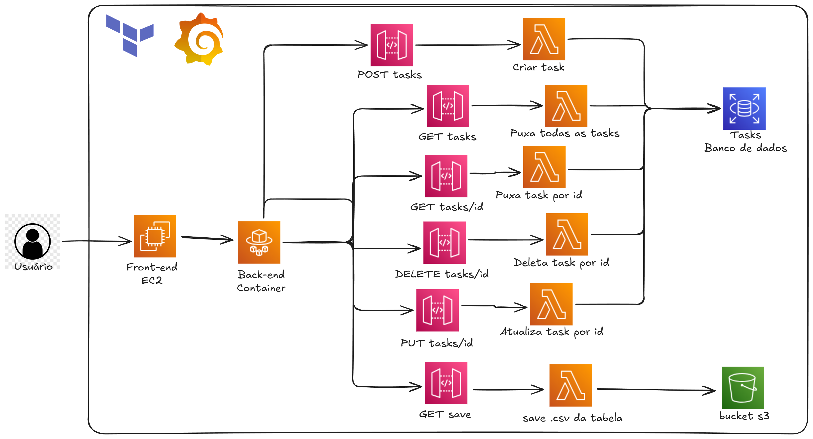

# Projeto Nuvem – Sistema de Tarefas na AWS

Infraestrutura completa em AWS para um sistema de tarefas, provisionada com **Terraform**, seguindo práticas de **IaC**, automação, segurança e arquitetura desacoplada.

## 👥 Participantes

- **Gabriel Dutra**
- **Christian Kawamura**
- **Iago Correia**

---

## 🏗️ Arquitetura da Solução

A solução utiliza serviços gerenciados e componentes serverless da AWS para garantir modularidade, escalabilidade e baixo acoplamento.

Abaixo está o diagrama da arquitetura utilizada:

---

## 🔧 Componentes Principais

### 🖥️ Front-end (EC2)

- Aplicação frontend hospedada em uma instância **Amazon EC2**.
- Interface para interação do usuário.
- Responsável por enviar requisições ao backend containerizado.

### 📦 Back-end (ECS)

- Aplicação backend executando em um container dentro do **Amazon ECS**.
- Processa requisições e integra com API Gateway e banco de dados.

### 🔗 API Gateway

Criamos vários endpoints REST para orquestrar o sistema:

| Método | Rota          | Função               |
| ------ | ------------- | -------------------- |
| POST   | `/tasks`      | Cria nova task       |
| GET    | `/tasks`      | Busca todas as tasks |
| GET    | `/tasks/{id}` | Busca task por ID    |
| PUT    | `/tasks/{id}` | Atualiza task        |
| DELETE | `/tasks/{id}` | Remove task          |
| GET    | `/save`       | Exporta tasks em CSV |

### 🐑 Lambdas

Cada endpoint do API Gateway aciona uma Lambda responsável por uma operação específica:

- Criar task
- Buscar todas as tasks
- Buscar task por ID
- Atualizar task
- Deletar task
- Gerar e salvar CSV da tabela

### 🗄️ Banco de Dados (RDS MySQL)

- Persistência de dados utilizando **AWS RDS MySQL**.

### 🪣 Armazenamento (S3)

- Buckets S3 utilizados para armazenar os arquivos **CSV** exportados.

---

## 🎯 Objetivo do Projeto

Este projeto demonstra a construção de uma arquitetura completa e escalável utilizando:

- EC2 para frontend
- ECS com containers para backend
- API Gateway para roteamento inteligente
- Lambda Functions para lógica serverless
- RDS MySQL para persistência
- S3 para armazenamento de arquivos
- Terraform para provisionamento automatizado de toda a infraestrutura
- Grafana para monitoramento
